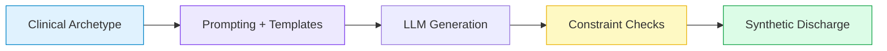
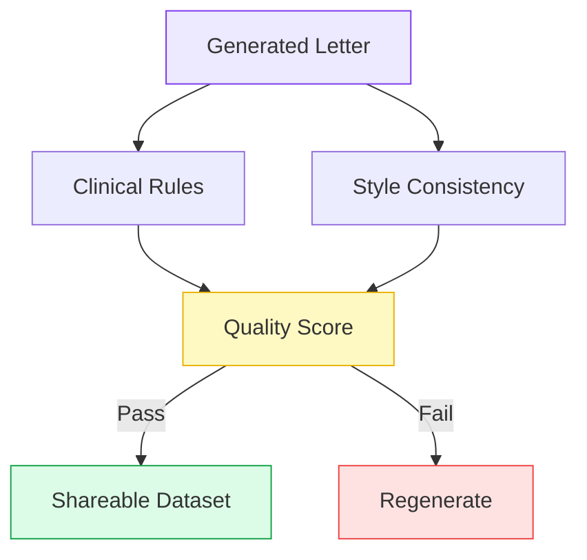

## Synthetic Discharge Summaries

**The Clinical Turing Test for Medical NLP**

Medical Informatics Elective · 5 minutes

<div class="abs-br m-6 text-sm opacity-50">
  Press <kbd>space</kbd> to advance · <kbd>?</kbd> for controls
</div>

---

## Why We Need Synthetic Clinical Text

---

## Why We Need Synthetic Clinical Text

<div class="grid grid-cols-2 gap-10 mt-6">
<div>

### The Data Dilemma

- Real discharge letters cannot leave hospital infrastructure.
- Anonymization is slow, costly, and often removes clinical nuance.
- Research stalls because *data sharing is blocked*.

:::info {title="Goal"}
Generate **realistic, privacy-safe** discharge summaries that keep clinical logic intact.
:::

</div>
<div>

```mermaid {scale: 1.0}
%%{init: {
  'theme': 'base',
  'themeVariables': {
    'fontFamily': 'Inter, ui-sans-serif, system-ui, -apple-system, Segoe UI, Roboto, Helvetica, Arial',
    'fontSize': '9px',
    'lineColor': '#6366f1',
    'clusterBkg': '#f8fafc',
    'clusterBorder': '#94a3b8',
    'primaryColor': '#e0e7ff',
    'primaryBorderColor': '#4f46e5',
    'primaryTextColor': '#1e1b4b'
  },
  'flowchart': {
    'useMaxWidth': true,
    'htmlLabels': false,
    'nodeSpacing': 20,
    'rankSpacing': 28,
    'curve': 'catmullRom'
  }
}}%%
flowchart LR
  S([Clinical Need\nEHR not shareable])

  subgraph BAD[Current Barrier]
    direction TB
    A1[De-ID]
    A2[Context Loss]
    A3[Low NLP Utility]
    A4[Research Blocked]
    A1 --> A2 --> A3 --> A4
  end

  subgraph GOOD[Synthetic Path]
    direction TB
    B1[Synthetic Generation]
    B2[Safety Checks]
    B3[Shareable Data]
    B4[Training + Research]
    B1 --> B2 --> B3 --> B4
  end

  S --> A1
  S --> B1

  classDef bad fill:#fee2e2,stroke:#dc2626,stroke-width:2px,color:#7f1d1d;
  classDef good fill:#dcfce7,stroke:#16a34a,stroke-width:2px,color:#14532d;
  classDef neutral fill:#e0e7ff,stroke:#4f46e5,stroke-width:2px,color:#1e1b4b;
  classDef badGroup fill:#fff1f2,stroke:#ef4444,stroke-width:1.5px,color:#7f1d1d;
  classDef goodGroup fill:#ecfdf5,stroke:#22c55e,stroke-width:1.5px,color:#14532d;

  class S neutral;
  class A1,A2,A3,A4 bad;
  class B1,B2,B3,B4 good;
  class BAD badGroup;
  class GOOD goodGroup;

  linkStyle 0,1,2,3 stroke:#ef4444,stroke-width:2px;
  linkStyle 4,5,6,7 stroke:#16a34a,stroke-width:2px;
  linkStyle 8 stroke:#ef4444,stroke-width:2.5px;
  linkStyle 9 stroke:#16a34a,stroke-width:2.5px;
```

</div>
</div>

---

## Project C: Generation Pipeline

<div class="grid grid-cols-2 gap-10 mt-6">
<div>
### Inputs

- Archetype scenarios from clinicians
- Local LLMs on-premise (Llama 3, Mistral)
- Few-shot style templates

### Outputs

- Coherent discharge summaries
- Consistent diagnoses, meds, follow-up

</div>
<div>



</div>
</div>

---

## Safety & Quality Gates

<div class="grid grid-cols-2 gap-10 mt-6">
<div>

### Automated Checks

- Allergy conflicts (e.g., penicillin)
- Medication-diagnosis consistency
- Vital sign plausibility
- Temporal logic (admit -> treat -> discharge)

:::warning {title="Red Flags"}
Hallucinated meds, impossible timelines, missing follow-up.
:::

</div>
<div>



</div>
</div>

---
layout: end
class: text-center
---

# The Clinical Turing Test

<div class="grid grid-cols-2 gap-8 mt-6 text-left">
<div>

### Evaluation

- 20 real + 20 synthetic letters
- Blind review by medical students and clinicians
- Pass if reviewers cannot reliably tell the difference

</div>
<div>

### Student Roles

- **Medical:** define archetypes, review realism
- **CS:** prompting, validation, local inference

:::tip {title="Why it matters"}
If the test is passed, we unlock privacy-safe NLP research.
:::

</div>
</div>

<div class="mt-8 text-sm opacity-70">
Contact: Philipp Wiesenbach · Emre Calik
Dieterichlab, Computational Cardiology
</div>
