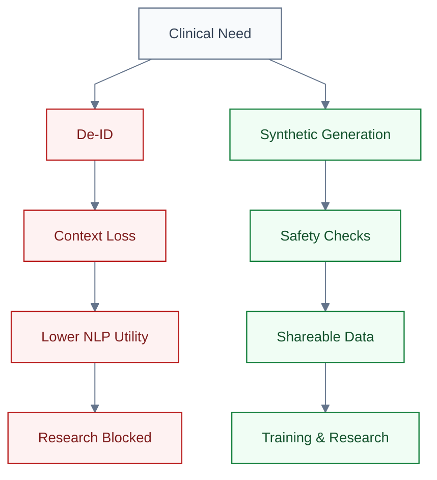
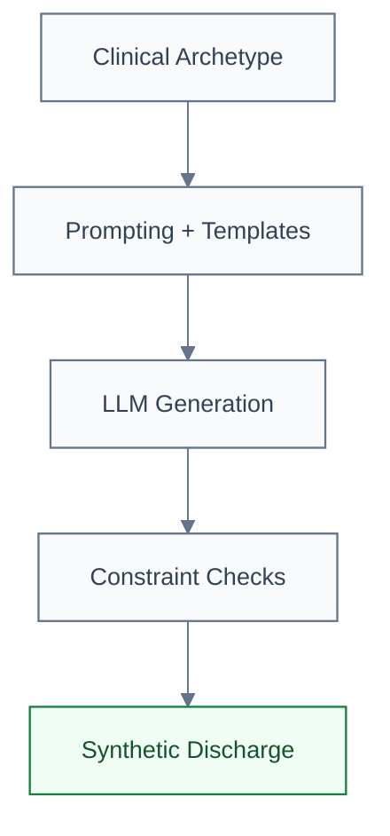
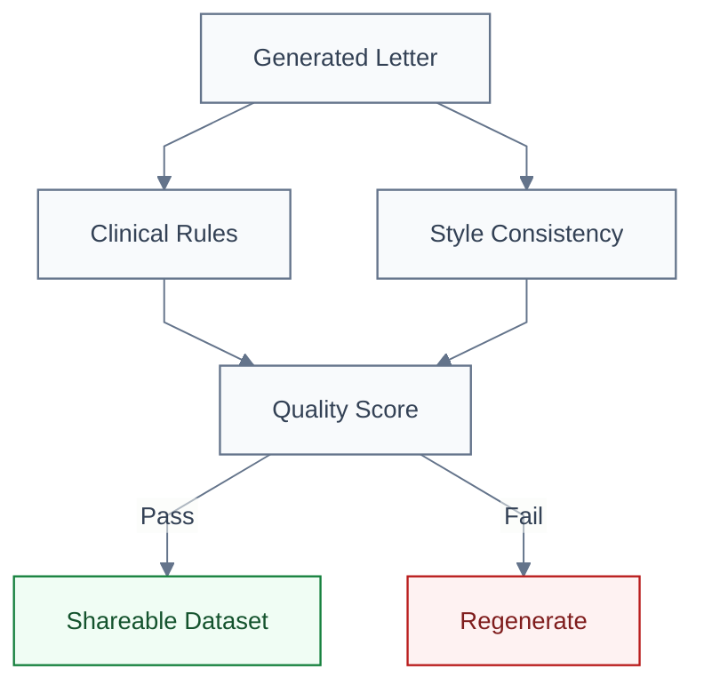

## Synthetic Discharge Summaries

**The Clinical Turing Test for Medical NLP**

Medical Informatics Elective · 5 minutes

  Press <kbd>space</kbd> to advance · <kbd>?</kbd> for controls

---

## Why We Need Synthetic Clinical Text

---

## Why We Need Synthetic Clinical Text

### The Data Dilemma

- Real discharge letters cannot leave hospital infrastructure.
- Anonymization is slow, costly, and often removes clinical nuance.
- Research stalls because *data sharing is blocked*.

:::info {title="Goal"}
Generate **realistic, privacy-safe** discharge summaries that keep clinical logic intact.
:::

---

## Project C: Generation Pipeline

### Inputs

- Archetype scenarios from clinicians
- Local LLMs on-premise (Llama 3, Mistral)
- Few-shot style templates

### Outputs

- Coherent discharge summaries
- Consistent diagnoses, meds, follow-up

---

## Safety & Quality Gates

### Automated Checks

- Allergy conflicts (e.g., penicillin)
- Medication-diagnosis consistency
- Vital sign plausibility
- Temporal logic (admit -> treat -> discharge)

:::warning {title="Red Flags"}
Hallucinated meds, impossible timelines, missing follow-up.
:::

---
class: text-center
---

## Project Timeline

  <table class="gantt-table">
    <thead>
      <tr>
        <th class="gantt-task">Task</th>
        <th>12 Mar</th>
        <th>19 Mar</th>
        <th>26 Mar</th>
        <th>2 Apr</th>
        <th>9 Apr</th>
        <th>16 Apr</th>
        <th>23 Apr</th>
        <th>30 Apr</th>
        <th>7 May</th>
        <th>14 May</th>
        <th>21 May</th>
        <th>28 May</th>
        <th>4 Jun</th>
        <th>11 Jun</th>
        <th>18 Jun</th>
        <th>25 Jun</th>
      </tr>
    </thead>
    <tbody>
      <tr>
        <td class="gantt-task">Initial Presentation</td>
        <td class="milestone"></td><td></td><td></td><td></td><td></td><td></td><td></td><td></td><td></td><td></td><td></td><td></td><td></td><td></td><td></td><td></td>
      </tr>
      <tr>
        <td class="gantt-task">Team Formation</td>
        <td class="bar-green bar-start"></td><td class="bar-green"></td><td class="bar-green bar-end"></td><td></td><td></td><td></td><td></td><td></td><td></td><td></td><td></td><td></td><td></td><td></td><td></td><td></td>
      </tr>
      <tr>
        <td class="gantt-task">Literature Review</td>
        <td class="bar-green bar-start"></td><td class="bar-green"></td><td class="bar-green"></td><td class="bar-green bar-end"></td><td></td><td></td><td></td><td></td><td></td><td></td><td></td><td></td><td></td><td></td><td></td><td></td>
      </tr>
      <tr>
        <td class="gantt-task">Data Collection</td>
        <td></td><td class="bar-blue bar-start"></td><td class="bar-blue"></td><td class="bar-blue"></td><td class="bar-blue bar-end"></td><td></td><td></td><td></td><td></td><td></td><td></td><td></td><td></td><td></td><td></td><td></td>
      </tr>
      <tr>
        <td class="gantt-task">Template Design</td>
        <td></td><td></td><td class="bar-blue bar-start"></td><td class="bar-blue"></td><td class="bar-blue"></td><td class="bar-blue bar-end"></td><td></td><td></td><td></td><td></td><td></td><td></td><td></td><td></td><td></td><td></td>
      </tr>
      <tr>
        <td class="gantt-task">LLM Setup</td>
        <td></td><td></td><td></td><td class="bar-green bar-start"></td><td class="bar-green"></td><td class="bar-green"></td><td class="bar-green bar-end"></td><td></td><td></td><td></td><td></td><td></td><td></td><td></td><td></td><td></td>
      </tr>
      <tr>
        <td class="gantt-task">Generation</td>
        <td></td><td></td><td></td><td></td><td class="bar-green bar-start"></td><td class="bar-green"></td><td class="bar-green"></td><td class="bar-green"></td><td class="bar-green"></td><td class="bar-green bar-end"></td><td></td><td></td><td></td><td></td><td></td><td></td>
      </tr>
      <tr>
        <td class="gantt-task">Validation</td>
        <td></td><td></td><td></td><td></td><td></td><td></td><td></td><td class="bar-blue bar-start"></td><td class="bar-blue"></td><td class="bar-blue"></td><td class="bar-blue"></td><td class="bar-blue"></td><td class="bar-blue bar-end"></td><td></td><td></td><td></td>
      </tr>
      <tr>
        <td class="gantt-task">Mid-term Presentation</td>
        <td></td><td></td><td></td><td></td><td></td><td></td><td></td><td></td><td class="milestone"></td><td></td><td></td><td></td><td></td><td></td><td></td><td></td>
      </tr>
      <tr>
        <td class="gantt-task">Finalization</td>
        <td></td><td></td><td></td><td></td><td></td><td></td><td></td><td></td><td></td><td></td><td></td><td></td><td></td><td class="bar-green bar-start"></td><td class="bar-green bar-end"></td><td></td>
      </tr>
      <tr>
        <td class="gantt-task">Final Presentation</td>
        <td></td><td></td><td></td><td></td><td></td><td></td><td></td><td></td><td></td><td></td><td></td><td></td><td></td><td></td><td></td><td class="milestone"></td>
      </tr>
    </tbody>
  </table>

---
class: text-center
layout: end
---

# The Clinical Turing Test

### Evaluation

- 20 real + 20 synthetic letters
- Blind review by medical students and clinicians
- Pass if reviewers cannot reliably tell the difference

### Student Roles

- **Medical:** define archetypes, review realism
- **CS:** prompting, validation, local inference

:::tip {title="Why it matters" class="mt-6 text-lg leading-snug font-semibold"}
✅ **If the test is passed, we unlock privacy-safe NLP research.**
:::

Contact: Philipp Wiesenbach · Emre Calik

Dieterichlab, Computational Cardiology

