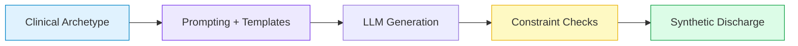
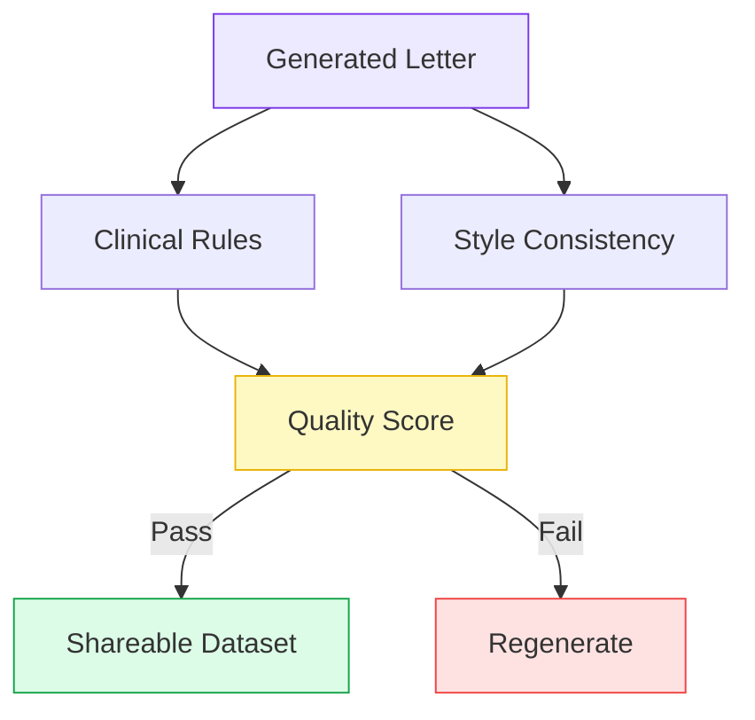

## Synthetic Discharge Summaries

**The Clinical Turing Test for Medical NLP**

Medical Informatics Elective · 5 minutes

  Press <kbd>space</kbd> to advance · <kbd>?</kbd> for controls

---

## Why We Need Synthetic Clinical Text

### The Data Dilemma

- Real discharge letters cannot leave hospital infrastructure.
- Anonymization is slow, costly, and often removes clinical nuance.
- Research stalls because *data sharing is blocked*.

:::info {title="Goal"}
Generate **realistic, privacy-safe** discharge summaries that keep clinical logic intact.
:::

  

    <Motion tag="div" class="flow-node danger" :initial="{ opacity: 0, y: 12 }" :enter="{ opacity: 1, y: 0, transition: { delay: 0.1 } }">
      Real EHR Text
    </Motion>
    
→

    <Motion tag="div" class="flow-node warn" :initial="{ opacity: 0, y: 12 }" :enter="{ opacity: 1, y: 0, transition: { delay: 0.2 } }">
      Blocked Sharing
      
Privacy Risk

    </Motion>
  

  

    <Motion tag="div" class="flow-node muted" :initial="{ opacity: 0, y: 12 }" :enter="{ opacity: 1, y: 0, transition: { delay: 0.3 } }">
      De-ID
    </Motion>
    
→

    <Motion tag="div" class="flow-node muted" :initial="{ opacity: 0, y: 12 }" :enter="{ opacity: 1, y: 0, transition: { delay: 0.4 } }">
      Context Loss
    </Motion>
    
→

    <Motion tag="div" class="flow-node muted" :initial="{ opacity: 0, y: 12 }" :enter="{ opacity: 1, y: 0, transition: { delay: 0.5 } }">
      Low Utility
    </Motion>
  

  

    <Motion tag="div" class="flow-node good" :initial="{ opacity: 0, y: 12 }" :enter="{ opacity: 1, y: 0, transition: { delay: 0.6 } }">
      Synthetic Text
    </Motion>
    
→

    <Motion tag="div" class="flow-node good" :initial="{ opacity: 0, y: 12 }" :enter="{ opacity: 1, y: 0, transition: { delay: 0.7 } }">
      Shareable
    </Motion>
    
→

    <Motion tag="div" class="flow-node good" :initial="{ opacity: 0, y: 12 }" :enter="{ opacity: 1, y: 0, transition: { delay: 0.8 } }">
      Model Training
    </Motion>
  

---

## Project C: Generation Pipeline

### Inputs

- Archetype scenarios from clinicians
- Local LLMs on-premise (Llama 3, Mistral)
- Few-shot style templates

### Outputs

- Coherent discharge summaries
- Consistent diagnoses, meds, follow-up

---

## Safety & Quality Gates

### Automated Checks

- Allergy conflicts (e.g., penicillin)
- Medication-diagnosis consistency
- Vital sign plausibility
- Temporal logic (admit -> treat -> discharge)

:::warning {title="Red Flags"}
Hallucinated meds, impossible timelines, missing follow-up.
:::

---
layout: end
class: text-center
---

# The Clinical Turing Test

### Evaluation

- 20 real + 20 synthetic letters
- Blind review by medical students and clinicians
- Pass if reviewers cannot reliably tell the difference

### Student Roles

- **Medical:** define archetypes, review realism
- **CS:** prompting, validation, local inference

:::tip {title="Why it matters"}
If the test is passed, we unlock privacy-safe NLP research.
:::

Contact: Philipp Wiesenbach · Computational Cardiology, UKHD

